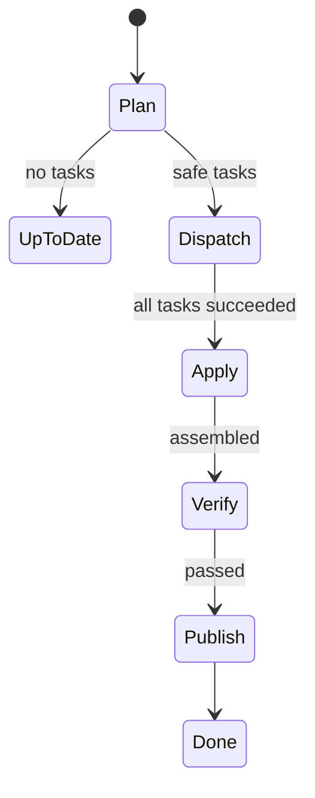
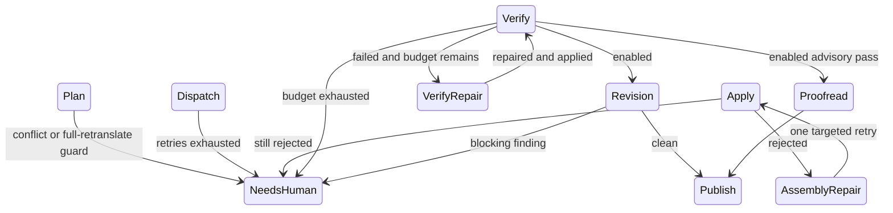

# Rust + SQLite rewrite design

Date: 2026-08-29
Status: implemented design for fani 0.2

## Inputs

This design combines:

- the independent 2026 Rust CLI research in [`../research/2026-rust-cli-stack.md`](../research/2026-rust-cli-stack.md), produced by subagent `01a04eca-0846-7282-a5c4-00ceb33e96ab` with dated official sources;
- the compatibility baseline in [`compatibility-baseline.md`](compatibility-baseline.md);
- an independent flow review by subagent `01a04eca-0846-7282-a5c4-00e18a8558f3`;
- the external i18n skill as an unchanged subprocess/JSON compatibility boundary.

### Attributable subagent findings

- Research subagent `01a04eca-0846-7282-a5c4-00ceb33e96ab` found that the maintained 2026 baseline favors `clap` derive, typed `serde` boundaries, `rusqlite` for a local single-writer ledger, `thiserror`/`anyhow`, black-box CLI tests, and separate supply-chain checks. It recommended adopting Tokio, `tracing`, and cargo-dist as the preferred direction, while rejecting `sqlx` and `cross` as default choices for this workload; the implementation deviations are recorded explicitly below.
- Flow-review subagent `01a04eca-0846-7282-a5c4-00e18a8558f3` found that Python 0.1 continued into apply after failed dispatch, represented repair/review as a long apparent sequence, and implemented revision without the documented proofread path. Those findings directly produced the failure-only branches and call-count assertions in `tests/flow.rs`.
- Compatibility-audit subagent `01a04eca-0846-7282-a5c4-00da8cbc9163` identified the stable CLI, exit-status, external-skill, lock, report, and Git-index contracts captured in [`compatibility-baseline.md`](compatibility-baseline.md).

## Adopted and rejected technology decisions

| Candidate | Decision | Reason |
| --- | --- | --- |
| Rust 2024 edition | Adopt | Single native executable, strong protocol/config models, explicit process and error handling. |
| `clap` derive | Adopt | The three static commands map directly to typed subcommands and preserve conventional help/exit behavior. |
| `serde`, `serde_json`, `toml` | Adopt | Typed TOML configuration and typed external JSON protocol; raw `Value` is retained only for open-ended skill findings/written records. |
| `rusqlite` bundled | Adopt | fani is a local single-writer systemd job and needs transactional run history, locks, migrations, and imports, not a network database abstraction. |
| `sqlx` | Reject | Async pools and multi-database support add no value for one local SQLite file per repository. |
| Tokio | Defer | The research recommends Tokio for larger asynchronous process fleets. The current bounded workload maps to one worker thread per configured concurrent Agent process, while skill/Git remain sequential. Standard threads plus a command-local Rust supervisor/subreaper keep deadlines and process-tree cleanup explicit without a runtime dependency. Reconsider when streaming output, cross-repository concurrency, or service mode is introduced. |
| `tracing` | Defer | Existing stdout/stderr text is a public automation contract. Durable structured events are stored in SQLite. Add tracing when a stable event schema and formatter switch are introduced rather than duplicating the database event stream. |
| `thiserror` + `anyhow` | Adopt | Domain/config errors remain classified; command boundaries attach path and stage context. |
| `assert_cmd` + `tempfile` | Adopt | Tests invoke the shipped binary against real temporary repositories, databases, files, subprocesses, and Git refs. |
| cargo-dist | Document for release | Suitable for future tagged binary releases; no release workflow is fabricated before repository hosting requirements are known. |
| cargo-audit + cargo-deny | Adopt as quality gates | Advisory and policy checks are part of verification; `deny.toml` records accepted license/source policy. |
| `cross` as primary builder | Reject | Native Linux CI is the required behavioral environment for process groups, SQLite, Git, and systemd; cross can be supplemental later. |

### Explicit deviations from the research recommendation

The research subagent recommended adopting Tokio, `tracing`, and cargo-dist as the preferred 2026 direction. The implemented 0.2 scope deliberately differs as follows:

| Research recommendation | Implemented decision | Why the implementation differs now | Reconsideration trigger |
| --- | --- | --- | --- |
| Adopt Tokio for subprocess I/O and timeout orchestration | Defer; use bounded standard threads plus a command-local Rust supervisor/subreaper | The shipped workload has bounded Agent concurrency and sequential skill/Git calls. The supervisor gives one deadline across leader wait and pipe draining without adding a runtime or mixing synchronous SQLite into async tasks. | Streaming Agent output, concurrent repositories, or long-lived service mode |
| Adopt `tracing`/`tracing-subscriber` | Defer; keep stable stderr text and durable SQLite records | Adding a second structured event stream before defining its compatibility and redaction schema would duplicate SQLite diagnostics and risk exposing prompts or credentials. | A versioned event schema and an explicit human/JSON formatter switch |
| Adopt cargo-dist for release automation | Document but do not generate a release workflow | The repository has no confirmed release host, target matrix, signing identity, or installer policy. Fabricating those choices would not produce a usable release. | A tagged-release policy with named targets and signing/hosting requirements |

These are scoped deferrals, not silent omissions. `sqlx` and `cross` remain explicit rejections for the current workload, while `clap`, `rusqlite`, typed serde boundaries, Rust test tooling, and both supply-chain checks are implemented.

## Runtime architecture

```text
fani.toml
   │
   ▼
Rust CLI ── typed validation ── SQLite schema migration
   │                              │
   │                              ├─ run/language history
   │                              ├─ Agent call records
   │                              ├─ transitions
   │                              ├─ repository lock
   │                              └─ legacy JSON imports
   │
   ▼
external i18n skill (JSON protocol)
   │
   ▼
bounded Agent process workers
   │
   ▼
external apply + verify
   │
   ├─ failure-only bounded repair/review
   ▼
Git plumbing publication
   │
   ▼
report.json + report.md
```

The external skill still owns translation memory and document semantics. Moving that `state.json` into fani's database would require changing a separate product and is explicitly outside this repository's compatibility boundary. fani imports a lossless snapshot for audit/migration history but does not become a second writer.

## SQLite model

One database lives at:

```text
<repo>/<state_dir>/fani.db
```

### Tables

- `schema_migrations`: idempotent ordered schema versions and timestamps.
- `runs`: one CLI run per repository, config path, start/end, overall status, exit code.
- `language_runs`: one durable result per language, including open-ended protocol payloads, publication result, counters, and transition sequence.
- `agent_calls`: task/stage/Agent outcome and attempts, inserted in a short transaction immediately after each completed task so a later process crash does not erase finished external calls.
- `repo_locks`: repository-level PID/start lock acquired with `BEGIN IMMEDIATE` and removed by owner.
- `legacy_imports`: exact canonical JSON payload, source path, kind, digest, and import time; `(source_path, sha256)` makes import repeatable.

### Connection policy

- bundled SQLite;
- `foreign_keys=ON`;
- rollback journal (`journal_mode=DELETE`) because fani has one writer and no long-lived readers;
- `synchronous=FULL` for durable unattended state;
- 10 second busy timeout;
- short transactions only; no Agent, skill, or Git subprocess runs while a transaction is open.

### Migration and legacy compatibility

Opening a database applies every unapplied migration under an immediate transaction. Reopening is a no-op.

The first and subsequent runs idempotently import:

- external skill `state.json` as an audit snapshot;
- old Python `dispatch.jsonl` records;
- old Python `verify.json` records.

The exact effective JSON data is retained in `legacy_imports`. The external files are not deleted because the skill still owns its state and old work directories are useful diagnostics. The concrete rollback source is pre-rewrite commit `65332518abaa6980706aa553b83f69a21754527d`, which contains Python package version 0.1.0. That implementation reads the unchanged TOML and external skill files and ignores the new `fani.db`.

## Simplified orchestration

### Normal path



### Exceptional branches only



### Python 0.1 versus Rust 0.2 flow

| Scenario | Python 0.1 behavior | Rust 0.2 behavior | Observable reduction |
| --- | --- | --- | --- |
| Normal successful translation | `plan → dispatch → apply → verify → publish`; revision was appended only when enabled | `plan → dispatch → apply → verify → publish`; review transitions are absent unless configured | The normal path remains the minimum supported by the unchanged skill protocol; no fabricated `finalize` call is added |
| Agent dispatch exhausted | Continued into apply with missing results and could enter another rejected-file dispatch | Stops at `needs_human:dispatch_failed` before apply | Removes at least one useless skill call and prevents duplicate dispatch after a failed batch |
| Assembly rejection | Retry behavior was interleaved with the main path | Enters one explicit, bounded assembly-repair branch only on rejection | Repair disappears entirely from successful-run transitions and call counts |
| Verify failure | Entered repair logic without a concise recorded state sequence | Enters `repairing:verify:N` only while `repair_budget` remains | Keeps the safety repair while making its cost and bound observable |
| Review | Revision existed; configured proofread was not executed | Revision is optional/blocking; proofread is optional/advisory | No review Agent/skill calls occur on the default path; proofread now matches the documented setting |
| Agent-call persistence | Appended JSONL records around dispatch work | Records each completed call immediately in SQLite | Removes JSONL as fani-owned durable state while preserving crash-visible completed calls |

The before/after claims above are executable in `tests/flow.rs`; `{SCRATCH}/flow-verification.log` captures the call sequences and transitions from the shipped orchestrator.

### Concrete reductions

1. **Exhausted Agent calls stop before `apply`.** The Python implementation invoked apply with missing results, then often redispatched the same file. Rust returns `needs_human` immediately, preserving files and eliminating an unnecessary skill process and duplicate retry layer.
2. **Repair and review are no longer presented as mandatory stages.** They are explicit conditional transitions and are absent from a normal run's recorded transitions and call counts.
3. **JSONL append-per-task is removed.** Each completed Agent outcome is committed immediately to SQLite before the dispatcher proceeds, so completed external calls survive a later crash without retaining JSONL as a second durable source.
4. **SQLite is authoritative for locking.** During migration, Rust also holds the predecessor-compatible `<state_dir>/fani.lock` marker so an older Python process cannot overlap and corrupt the external skill state; ownership and stale detection use the same PID/time semantics, while durable lock history remains in SQLite.
5. **Result paths are validated before writing.** A malformed task cannot escape the repository.
6. **Proofread now follows its documented optional advisory behavior.** It executes only when configured and never blocks publication solely on findings.

The research's proposed `finalize` skill command could reduce normal skill subprocesses from three to two, but that command does not exist in the external skill contract. This implementation does not pretend otherwise. A future external-skill release can add staged `finalize`; the Rust state machine isolates that substitution behind `SkillApi`.

## Safety preservation

- Conflict and guard checks happen before Agent calls.
- A repository lock spans all selected languages.
- External skill state is backed up before mutation.
- Every Agent, skill, and Git command runs under a command-local Rust supervisor/subreaper. The same absolute deadline bounds leader wait and stdout/stderr draining; timeout requests TERM, escalates descendants to KILL, and reaps double-forked or `setsid` descendants even when the leader exits first or a descendant clears its environment.
- Assembly retry remains finite and failure-only.
- Verify repair remains bounded by `repair_budget`.
- Blocking revision remains optional and failure-only.
- Git uses a temporary index, allowlisted paths, and compare-and-swap `update-ref`.
- `fani.db` is explicitly not committed because it contains local scheduler history and lock state. External translation memory JSON remains committed atomically with translations.

## Report compatibility

The report retains the established status strings, exit codes, totals, language outcomes, dispatch records, and Markdown summary. Schema is incremented to `2` and adds database paths. SQLite is authoritative for history; the report remains a replaceable latest-run snapshot.

## Rollout and rollback

### Rollout

1. Build the Rust binary and run black-box tests against the real skill and fake Agent.
2. Install the binary at the existing `fani` path; systemd command-line arguments remain unchanged.
3. On first `doctor` or `sync`, create/migrate each repository database.
4. On first `sync`, import legacy JSON/JSONL records without deleting them.
5. Keep commit `65332518abaa6980706aa553b83f69a21754527d` reachable until the rollback window closes; it is the audited Python 0.1.0 source, not an assumed Git tag.

### Operational rollback to Python 0.1.0

Stop unattended execution before replacing the binary. The shipped user unit executes `%h/.cargo/bin/fani`, so install and verify the rollback executable at that exact path rather than relying on whichever `fani` appears first on `PATH`. Preserve both SQLite and the Rust executable for a later forward recovery:

```bash
backup_dir="<backup-directory>"
repo="<repo>"
state_dir="<state_dir>"
mkdir -p "$backup_dir"

systemctl --user stop fani.timer
systemctl --user stop fani.service || true
cp -a "$repo/$state_dir/fani.db" "$backup_dir/fani.db"
for suffix in -journal -wal -shm; do
  if [ -e "$repo/$state_dir/fani.db$suffix" ]; then
    cp -a "$repo/$state_dir/fani.db$suffix" "$backup_dir/fani.db$suffix"
  fi
done
cp -a "$HOME/.cargo/bin/fani" "$backup_dir/fani-rust-0.2"

rollback_dir="$(mktemp -d)"
git archive 65332518abaa6980706aa553b83f69a21754527d | tar -x -C "$rollback_dir"
UV_TOOL_BIN_DIR="$HOME/.cargo/bin" uv tool install --force --from "$rollback_dir" fani
"$HOME/.cargo/bin/fani" --help
rm -rf "$rollback_dir"
systemctl --user start fani.timer
```

The rollback executable continues to read the existing TOML and retained, protocol-compatible external skill JSON/JSONL. The skill still owns those files and their format, but their contents may have advanced through Rust-driven apply operations after cutover. Python 0.1.0 ignores `fani.db`, which remains excluded from Git publication, and cannot display Rust-only run history. Retain the archived database and Rust executable; restoring the executable at `$HOME/.cargo/bin/fani` returns the shipped user unit to Rust and makes that history available again. No reverse SQLite-to-JSON conversion or dual-write claim is made.

No dual-write mode is used: after Rust cutover, fani-owned durable state is written only to SQLite.
